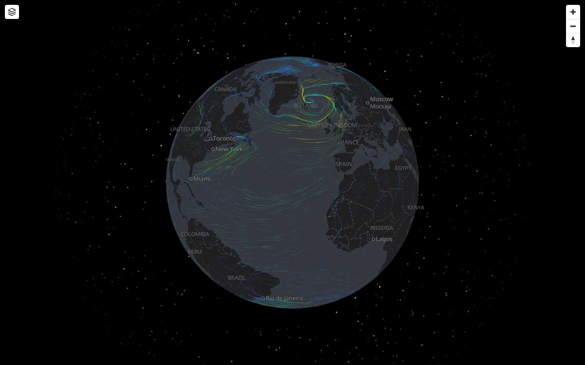

# maplibre-wind-gl

GPU-accelerated animated wind particle visualization for [MapLibre GL JS](https://maplibre.org/) with full **globe projection** support.

Particles are rendered entirely on the GPU as part of MapLibre's WebGL scene — they rotate, pan, and zoom with the globe natively. No canvas overlay, no deck.gl dependency.



## Features

- **Globe-native rendering** via MapLibre's `CustomLayerInterface` — particles live inside the WebGL scene
- **Age-stratified trails** — each particle leaves a fading trail of configurable length, no FBO compositing needed
- **GPU particle advection** — positions updated via render-to-texture, zero CPU overhead per frame
- **Horizon clipping** — particles behind the globe are hidden using MapLibre's clipping plane
- **Teleport suppression** — sphere-space dot product filter prevents lines when particles reset
- **Speed-based color ramp** — particles colored by wind speed using a customizable gradient, or a flat color
- **Single file, zero dependencies** — just `maplibre-wind-gl.js` (~480 lines), works with any MapLibre 4.x/5.x setup
- **Fully runtime-tunable** — speed, trail length, color ramp, opacity, and speed range can all be changed on the fly

## Live demo

[maps.beachlab.org/map/?weather=wind&theme=dark](https://maps.beachlab.org/map/?weather=wind&theme=dark)

## Quick start

```html
<script src="maplibre-gl.js"></script>
<script src="maplibre-wind-gl.js"></script>
<script>
var map = new maplibregl.Map({
  container: 'map',
  style: 'https://demotiles.maplibre.org/style.json',
  center: [0, 30],
  zoom: 1.5,
  projection: 'globe',
});

map.on('load', function () {
  var windLayer = new MaplibreWindGL('wind-particles', {
    data: '/weather/wind-surface.json',
    particles: 100000,
    speed: 1,
    maxAge: 15,
    opacity: 0.4,
    // Default: speed-based color ramp (indigo → blue → green → yellow → red)
    // Or use a flat color: color: [1, 1, 1]
  });
  map.addLayer(windLayer);
});
</script>
```

## Wind data format

The library expects a JSON array of two objects (U and V wind components) in the GFS/grib2json format:

```json
[
  {
    "header": { "nx": 360, "ny": 181, ... },
    "data": [/* U component values, 1-degree grid */]
  },
  {
    "header": { "nx": 360, "ny": 181, ... },
    "data": [/* V component values, 1-degree grid */]
  }
]
```

This is the same format produced by [grib2json](https://github.com/cambecc/grib2json) from GFS GRIB2 files. The data covers a global equirectangular grid (typically 1-degree resolution, 360x181).

## API

### Constructor

```js
var layer = new MaplibreWindGL(id, options);
```

| Option | Type | Default | Description |
|--------|------|---------|-------------|
| `data` | `string` | — | URL to wind JSON data |
| `particles` | `number` | `100000` | Number of particles |
| `speed` | `number` | `0.2` | Advection speed (how fast particles move) |
| `maxAge` | `number` | `8` | Trail length in frames (higher = longer trails) |
| `dropRate` | `number` | `0.003` | Base probability of particle reset per frame |
| `dropRateBump` | `number` | `0.01` | Additional reset probability in low-wind areas |
| `colorRamp` | `number[][]` | see below | Speed-based color stops: `[[speed, r, g, b], ...]` (0-1 RGB) |
| `color` | `number[3]` | — | Flat RGB color (0-1 range). Overrides `colorRamp` if set |
| `opacity` | `number` | `0.4` | Overall opacity |
| `speedRange` | `number[2]` | `[0, 30]` | Wind speed range (m/s) for color ramp mapping |

Default color ramp (calm indigo → blue → teal → green → yellow → orange → red):

```js
[
  [0,  0.30, 0.20, 0.70],  // 0 m/s  — indigo
  [5,  0.10, 0.50, 0.90],  // 5 m/s  — blue
  [10, 0.10, 0.80, 0.60],  // 10 m/s — teal
  [15, 0.40, 0.90, 0.20],  // 15 m/s — green
  [20, 0.90, 0.90, 0.10],  // 20 m/s — yellow
  [25, 0.90, 0.50, 0.10],  // 25 m/s — orange
  [30, 0.90, 0.10, 0.10],  // 30 m/s — red
]
```

### Methods

| Method | Description |
|--------|-------------|
| `setData(url)` | Load new wind data (returns Promise) |
| `setSpeed(n)` | Change advection speed |
| `setMaxAge(n)` | Change trail length (rebuilds ring buffer) |
| `setOpacity(n)` | Change opacity |
| `setColorRamp(stops)` | Set speed-based color ramp (array of `[speed, r, g, b]`) |
| `setColor([r, g, b])` | Switch to flat color (overrides color ramp) |
| `setSpeedRange([min, max])` | Set wind speed range for color mapping |

The layer implements MapLibre's `CustomLayerInterface` — add it with `map.addLayer(layer)` and remove with `map.removeLayer(id)`.

## How it works

### Architecture

```
Wind JSON ──→ windDataToTexture() ──→ Wind texture (360×181 RGBA)
                                          │
colorRamp ──→ buildColorRampPixels() ──→ Color ramp texture (256×1)
                                          │
                                          ▼
                     ┌──────── Update shader (prerender) ────────┐
                     │  Reads: state[n-1] + wind texture         │
                     │  Writes: state[n] (advected positions)    │
                     │  Ring buffer of maxAge+1 state textures   │
                     └───────────────────────────────────────────┘
                                          │
                                          ▼
                     ┌──────── Draw shader (render) ─────────────┐
                     │  For each age level (oldest → newest):    │
                     │    Bind state[age-1] as prev              │
                     │    Bind state[age] as curr                │
                     │    Sample wind speed → color ramp texture │
                     │    Draw GL_LINES with fading alpha        │
                     │  Age 0 (newest) = full opacity            │
                     │  Age maxAge (oldest) = transparent        │
                     └───────────────────────────────────────────┘
```

### Key techniques

- **RGBA 16-bit position encoding**: `pos.x = R/255 + B`, `pos.y = G/255 + A` — gives ~65k resolution in each axis
- **Equirectangular → 3D unit sphere**: `lon = x·2π`, `lat = (0.5−y)·π`, `sphere = (sin(lon)·cos(lat), sin(lat), cos(lon)·cos(lat))`
- **Globe matrix projection**: MapLibre's `mainMatrix` expects unit-sphere coordinates in globe mode
- **Teleport filter**: `step(0.95, dot(s0, s1))` in sphere space suppresses lines when particles reset to random positions
- **Both-endpoint clipping**: `step(0.05, clip0) · step(0.05, clip1)` — hides the entire line if either endpoint is behind the globe
- **Age-stratified trails**: ring buffer of N state textures, each drawn as GL_LINES with linearly decreasing alpha — no FBO trail accumulation needed
- **Speed-based color ramp**: 256×1 texture generated from interpolated color stops, sampled in the fragment shader using normalized wind speed

## Compatibility

- MapLibre GL JS 4.x and 5.x (tested with 5.9.0)
- Globe and Mercator projections
- WebGL 1 and WebGL 2
- Works in all modern browsers (Chrome, Firefox, Safari, Edge)

## Known limitations

- **1px line width**: WebGL2 in Chrome always renders `GL_LINES` at 1px (ignores `gl.lineWidth()`). Thicker lines would require a triangle-strip approach.
- **Polar distortion**: `cos(lat)` correction in the update shader causes faster particle movement near poles.
- **Sparse at high zoom**: Particles are distributed globally, so zoomed-in views show fewer particles.

## Credits

Inspired by the [earth.nullschool.net](https://earth.nullschool.net) wind visualization technique by Cameron Beccario, and the [mapbox-gl-wind](https://github.com/astrosat/mapbox-gl-wind) / [maplibre-gl-wind](https://github.com/geoql/maplibre-gl-wind) projects. The age-stratified trail approach is inspired by geoql's deck.gl-based implementation.

## License

MIT
